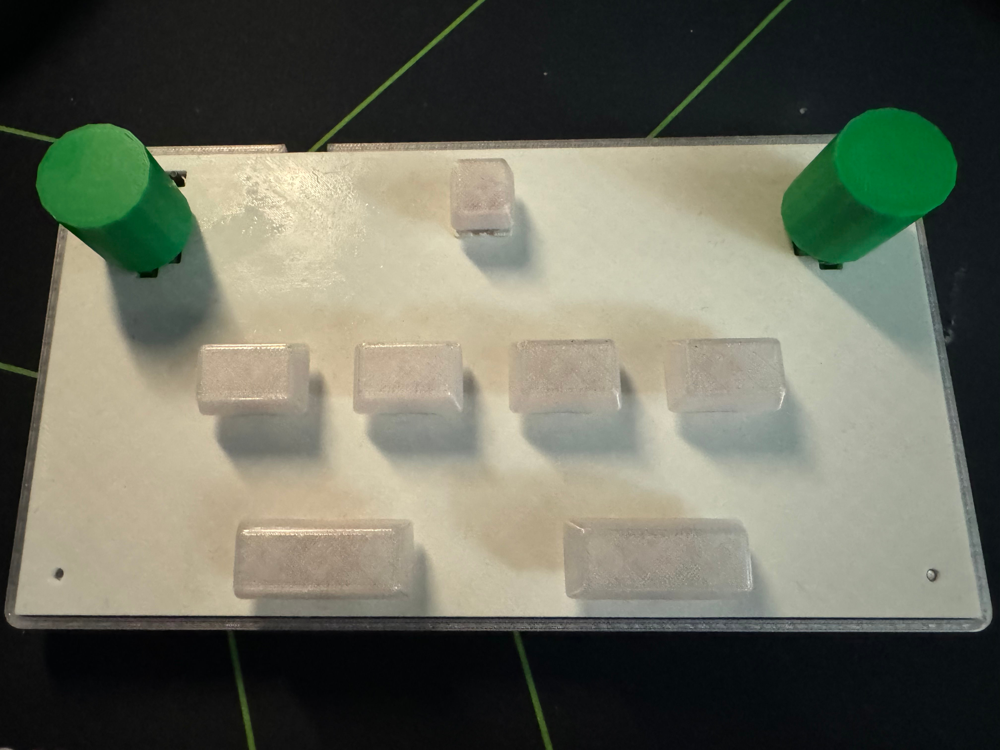

## pico-sdvx-2

my second attempt at a custom rhythm game controller for Sound Voltex

this one uses a PCB. connects via micro usb directly into the raspberry pi pico.

dimensions:

fully assembled: 235 mm x 130 mm x 50 mm (including height of knobs and rubber feet)

### pictures:

### parts:

1. 1x 3d printed case (see picosdvx2-top.stl and picosdvx2-bottom.stl)
2. 4x 1.5u keycaps, 2x 2.25u keycaps, 1x 1u keycap (3d printed)
3. 2x 3d printed knobs (picosdvx2-encodercap.stl)
4. 2x PEC16-4015F-N0024 (encoders)
5. 1x Raspberry Pi Pico
7. 7x MX-style hot-swap Switches (i used reds)
8. 4x rubber feet
9. 3x buttons (for controlling)
10. 7x per key leds (4x blue, 2x red, 1x green)
11. 10x rgb edge leds (ws2812b-5050)

### code

written using circuitpython and the adafruit hid gamepad libraries. make sure to install the required libraries.

this does spoof sdvx eac with a custom circuitpython build. settings configurable in `setup.py`.

### pcb

built using kicad, ordered via JLCPCB. 10x PCBs cost around ~100$, including some PCBA.

### controls

one button toggles LEDs, another switches between control mappings. last button is currently unused.

### credits:
keycaps: https://thangs.com/designer/demitriaswilbert/
1u: https://www.printables.com/model/188979-flat-keycap-cherry-mx/files

heavily inspired by speedypotato's [Pocket SDVX Pico v4](https://github.com/speedypotato/Pocket-SDVX-Pico-v4)!