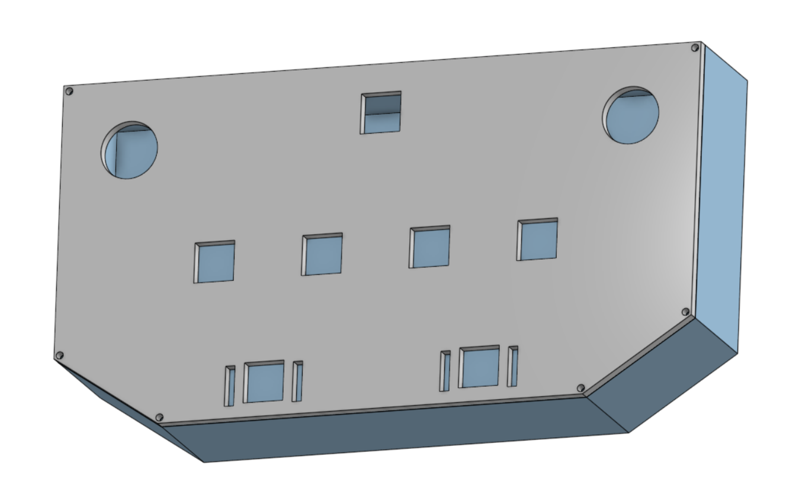
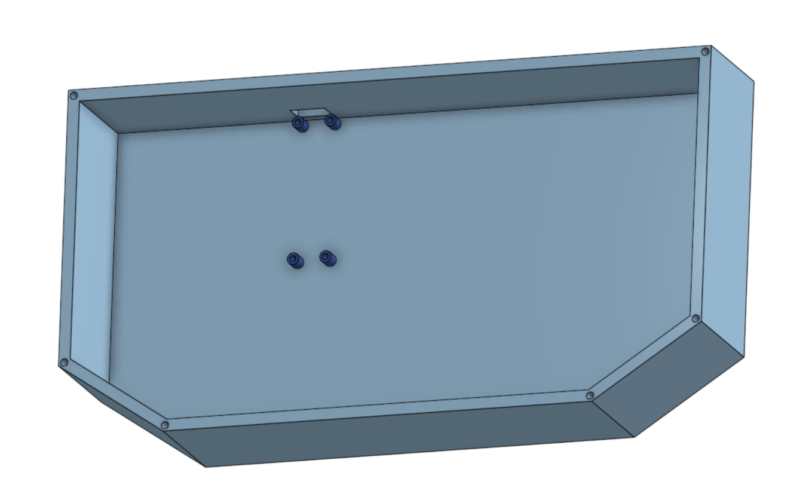
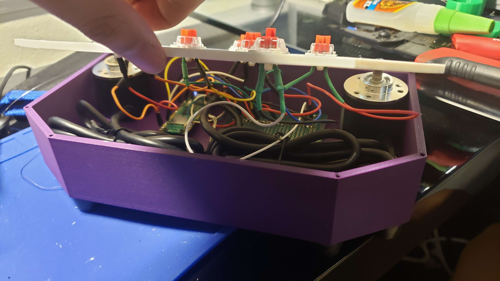

## pico-sdvx

my first attempt at a custom rhythm game controller for Sound Voltex

doesn't use a PCB, so everything is just hand wired and soldered in the case. connects via micro usb directly into the raspberry pi pico.

dimensions:

case: 225 mm x 120 mm x 45 mm

fully assembled: 225 mm x 120 mm x 90 mm (including height of knobs and rubber feet)

### pictures:

(mouse for scale)

(sorry about the terrible wiring)

### parts:

1. 1x 3d printed case (see sdvxbase.stl and sdvxtop.stl)
2. 4x 1.5u keycaps, 2x 2.25u keycaps, 1x 1u keycap (3d printed)
3. 2x 3d printed knobs (encoderknob.stl)
4. 2x 2mm tall adhesive circles (to attach the knobs to the case)
5. 1x Raspberry Pi Pico
6. 2x LPD3806 Optical Rotary Encoders (https://www.amazon.com/gp/product/B00Y9KDDCY/)
7. 7x MX-style Switches (i used reds)
8. 6x rubber feet
9. m2 and m2.5 screws

### code

written using circuitpython and the adafruid hid gamepad libraries. make sure to install the required libraries. knob speed & deadzone are configurable in `code.py`

### controls

hold START when plugging in the controller to switch to keyboard and mouse mode.

**gamepad mode:**
| key | gamepad |
| --- | ------------ |
| START | 1 |
| BTN A | 2 |
| BTN B | 3 |
| BTN C | 4 |
| BTN D | 5 |
| FX L | 6 |
| FX R | 7 |
| KNOB L | Axis X |
| KNOB R | Axis Y |

**kb + mouse mode:**
| key | kb / mouse  |
| --- | ------------ |
| START | ENTER |
| BTN A | D |
| BTN B | F |
| BTN C | J |
| BTN D | K |
| FX L | C |
| FX R | M |
| KNOB L | Mouse X |
| KNOB R | Mouse Y |

### build ~~instructions~~ general steps
1. 3d print case + keycaps + knobs
2. place both adhesive circles under the top shell knob holes inside the case
3. place both encoders on top of respective adhesives
4. screw in raspberry pi pico onto mount with m2 screws
5. snap in 7x mx-style switches on top print
6. wire + solder encoders to 3.3v on pico and gnd
7. wire the two encoder output channels onto the pico, and record the pin
8. wire each switch to 3.3v and a pico pin, record the pin
9. change the pins in `BTN_MAPPING` and `ENCODER_MAPPING` in `code.py`
10. snap top shell around the encoders (this holds the top in place)
11. attach printed knobs + keycaps
12. screw in top shell with m2.5 screws

### credits:
keycaps: https://thangs.com/designer/demitriaswilbert/