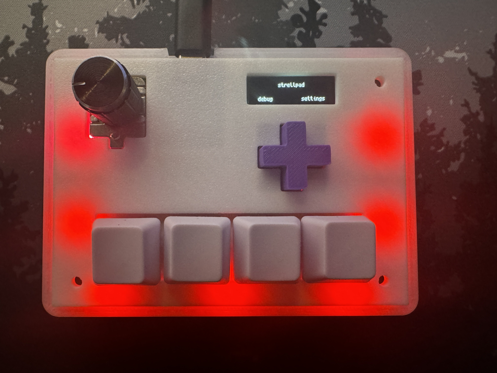
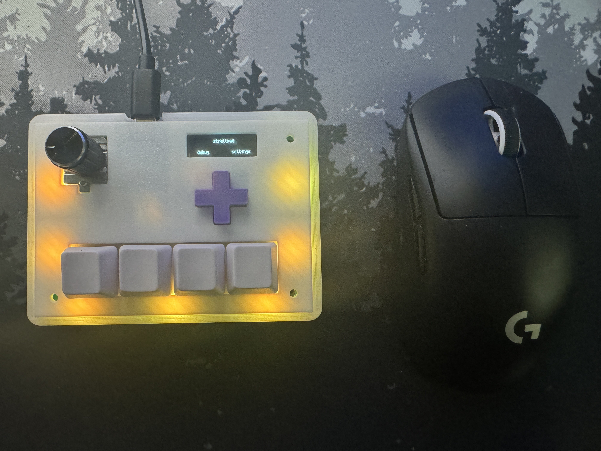

## strellpad 2

my second attempt at an analog hall effect keypad. built for osu! but can be configured to use as a general-purpose macro keypad.

4x HE switches + rotary encoder knob + dpad + screen

uses the waveshare rp2040 zero

### dimensions

fully assembled: ~110 mm x 80 mm x 40 mm (including height of feet & knob)

### features

* rapid trigger w configurable actuation
* fully configurable edge leds & per key leds, comes with multiple animations built in
* can configure all inputs to press any number of keys
* rotary encoder knob, configured by default to scroll up and down
* can do media controls (brightness, volume, next/prev track, play/pause)
* can act as a gamepad
* controllable via serial (including the WebSerial API)
* everything configurable on device via the oled display
* price: ~$20-30? (if you buy parts / pcbs for 10 keypads)

### pictures:






### parts:

1. 1x 3d printed case (see strellpad2-top.stl and strellpad2-bottom.stl)
2. 1x 3d printed dpad (see dpad.stl)
3. 4x hall effect switches (geon raptor HE) + 4x 1u keycaps
4. 11 rgb leds (ws2812b-5050) (4 key leds, 7 edge leds)
5. 1x PEC16-4015F-S0024 (rotary encoder, switch variant)
6. 4x BRIGHT TSA063G60-250 (dpad switches)
7. 1x waveshare rp2040-zero (buy the one with headers included)
8. 1x ssd1306 oled lcd display (128x32px)
9. 4x hall effect sensors (sot23, either SLSS49E or AH49ENTR-G1 are good)
10. various resistors + capacitors, check BOM for details

### serial

here's some example WebSerial code if you want to interact with the device using JavaScript:
```javascript
async function connect() {
    if (window.strellpad) return window.serialPort;
    window.strellpad = await navigator.serial.requestPort({ filters: [{ usbVendorId: 0x727 }] });
    await window.strellpad.open({ baudRate: 115200 });
    return window.strellpad;
}

async function run(command) {
    if (!window.strellpad) throw new Error("strellpad not connected");
        
    const id = Math.random().toString(36).slice(2,7);
    
    const encoder = new TextEncoder();
    const writer = window.strellpad.writable.getWriter();
    writer.write(encoder.encode(JSON.stringify({...command, id}) + "\n"));
    writer.releaseLock();

    let data = "";
    const reader = window.strellpad.readable.getReader();
    while (data.split(id).length !== 3) {
        const result = await reader.read();
        if (!result) continue;
        const decoder = new TextDecoder();
        const decoded = decoder.decode(result.value);
        data += decoded;
        await new Promise(r => setTimeout(r, 25));
    }
    reader.releaseLock();
    return JSON.parse(data.split(id)[1]);
}
```

### code

written using circuitpython and the adafruit hid gamepad libraries. make sure to install the required libraries.

### controls

use dpad to navigate menus, knob to change options / press to select. no program required on computer, everything is configurable from the device itself

### credits:

took inspiration from [Project Minipad](https://github.com/minipadKB)