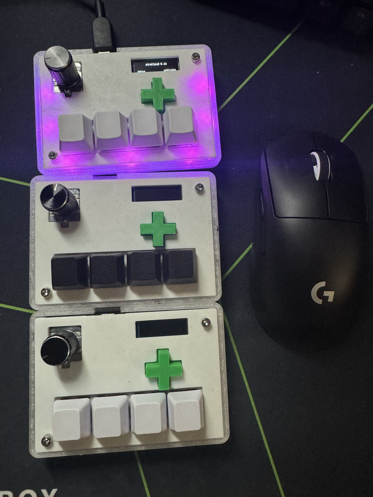

## strellpad

my first attempt at an analog hall effect keypad. built for osu! but can be configured to use as a general-purpose macro keypad.

4x HE switches + rotary encoder knob + dpad + screen

uses the waveshare rp2040 zero

### dimensions

fully assembled: ~100 mm x 70 mm x 35 mm (including height of knob

### features

* rapid trigger w configurable actuation
* fully configurable edge leds & per key leds, comes with multiple animations built in
* can configure all inputs to press any number of keys
* rotary encoder knob, configured by default to scroll up and down
* everything configurable on device via the lcd display
* price: ~$20-30? (if you buy parts / pcbs for 10 keypads)

### pictures:

### parts:

1. 1x 3d printed case (see strellpad-top.stl and strellpad-bottom.stl)
2. 1x 3d printed dpad (see dpad.stl)
3. 4x hall effect switches (geon raptor HE) + 4x 1u keycaps
4. 11 rgb leds (ws2812b-5050) (4 key leds, 7 edge leds)
5. 1x PEC16-4015F-S0024 (rotary encoder, switch variant)
6. 4x BRIGHT TSA063G60-250 (dpad switches)
7. 1x waveshare rp2040-zero (buy the one with headers included)
8. 1x ssd1306 oled lcd display (128x32px)
9. 4x hall effect sensors (sot23, either SLSS49E or AH49ENTR-G1 are good)
10. various resistors + capacitors, check BOM for details

### code

written using circuitpython and the adafruit hid gamepad libraries. make sure to install the required libraries.

### controls

use dpad to navigate menus, knob to change options / press to select. no program required on computer, everything is configurable from the device itself

### issues
* dpad is too close to bottom 4 keys
* edge leds and key leds on same data line, makes edge leds a bit laggy
* rotary encoder too close to mounting hole

### credits:
took inspiration from [Project Minipad](https://github.com/minipadKB)